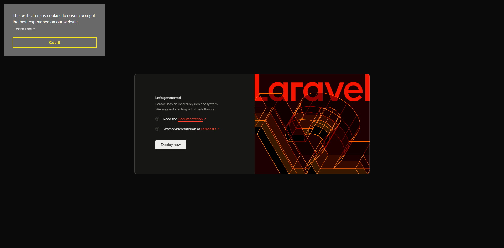
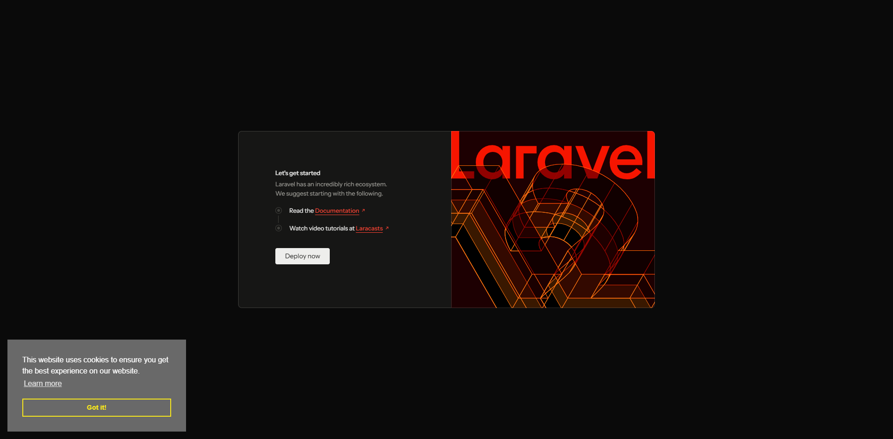
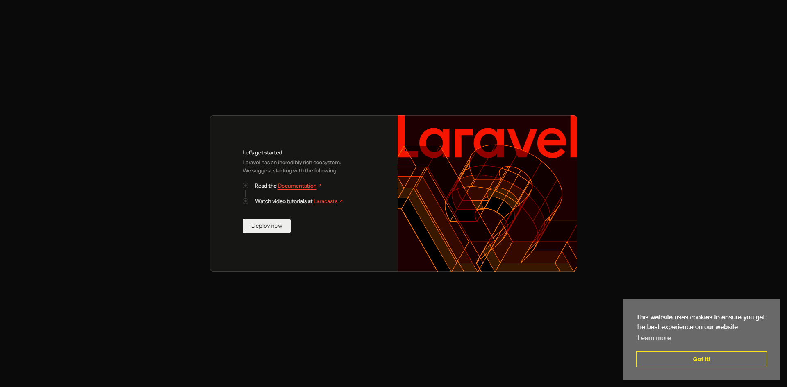

<div class="filament-hidden">


</div>

# Laravel Cookie Consent

[](https://packagist.org/packages/jeffersongoncalves/laravel-cookie-consent)
[](https://github.com/jeffersongoncalves/laravel-cookie-consent/actions?query=workflow%3A"Fix+PHP+code+styling"+branch%3Amaster)
[](https://packagist.org/packages/jeffersongoncalves/laravel-cookie-consent)

This Laravel package provides a simple and elegant way to implement cookie consent on your website, ensuring compliance with privacy regulations like GDPR and CCPA. It offers a clean and customizable interface, allowing you to easily manage and display cookie consent banners and preferences.

## Installation

You can install the package via composer:

```bash
composer require jeffersongoncalves/laravel-cookie-consent
```

Run the migrations to create the settings in the database:

```bash
php artisan migrate
```

## Usage

Add head template.

```php
@include('cookie-consent::cookie-consent-head')
```

Add body template.

```php
@include('cookie-consent::cookie-consent-body')
```

Publish views (optional).

```bash
php artisan vendor:publish --tag=cookie-consent-views
```

Publish translations (optional).

```bash
php artisan vendor:publish --tag=cookie-consent-translations
```

Publish settings migrations (optional).

```bash
php artisan vendor:publish --tag=cookie-consent-settings-migrations
```

## Configuration

All settings are stored in the database using [spatie/laravel-settings](https://github.com/spatie/laravel-settings). You can access and modify them at runtime using the `CookieConsentSettings` class or the `cookie_consent_settings()` helper.

### Accessing settings

```php
use JeffersonGoncalves\CookieConsent\Settings\CookieConsentSettings;

// Via helper
$settings = cookie_consent_settings();

// Via container
$settings = app(CookieConsentSettings::class);

// Read a value
$position = $settings->position;
```

### Updating settings

```php
$settings = cookie_consent_settings();
$settings->position = 'top-right';
$settings->popup_background = '#000000';
$settings->save();
```

### Available settings

| Property | Type | Default |
|----------|------|---------|
| `css_url` | `string` | `https://cdn.jsdelivr.net/npm/cookieconsent@3/build/cookieconsent.min.css` |
| `js_url` | `string` | `https://cdn.jsdelivr.net/npm/cookieconsent@3/build/cookieconsent.min.js` |
| `content_href` | `?string` | `null` |
| `content_close` | `string` | `&#x274c;` |
| `popup_background` | `string` | `#696969` |
| `popup_text` | `string` | `#FFFFFF` |
| `popup_link` | `string` | `#FFFFFF` |
| `button_background` | `string` | `transparent` |
| `button_border` | `string` | `#f8e71c` |
| `button_text` | `string` | `#f8e71c` |
| `highlight_background` | `string` | `#f8e71c` |
| `highlight_border` | `string` | `#f8e71c` |
| `highlight_text` | `string` | `#000000` |
| `position` | `string` | `bottom-left` |
| `theme` | `string` | `block` |

### Position

| Top Left | Top Right |
| :---: | :---: |
|  |  |
| **Bottom Left** | **Bottom Right** |
|  |  |

## Translations

This package supports multiple languages. The following languages are currently available:

- Arabic (`ar`)
- Czech (`cs`)
- German (`de`)
- English (`en`)
- Spanish (`es`)
- Persian (`fa`)
- French (`fr`)
- Hebrew (`he`)
- Indonesian (`id`)
- Italian (`it`)
- Japanese (`ja`)
- Dutch (`nl`)
- Polish (`pl`)
- Portuguese (`pt`)
- Portuguese (Brazil) (`pt_BR`)
- Portuguese (Portugal) (`pt_PT`)
- Slovak (`sk`)
- Turkish (`tr`)

If you want to customize the translations, you can publish the language files:

```bash
php artisan vendor:publish --tag=cookie-consent-translations
```

## Testing

```bash
composer test
```

## Changelog

Please see [CHANGELOG](CHANGELOG.md) for more information on what has changed recently.

## Contributing

Please see [CONTRIBUTING](.github/CONTRIBUTING.md) for details.

## Security Vulnerabilities

Please review [our security policy](../../security/policy) on how to report security vulnerabilities.

## Credits

This package uses the [Osano CookieConsent](https://github.com/osano/cookieconsent) plugin.

- [Jèfferson Gonçalves](https://github.com/jeffersongoncalves)
- [All Contributors](../../contributors)

## License

The MIT License (MIT). Please see [License File](LICENSE.md) for more information.
